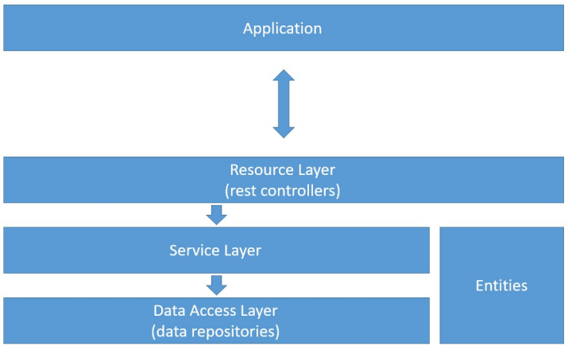

# Project: Spring Boot and JPA/Hibernate

The project was built using Java 17.

This project is part of the Java course on Udemy: [JAVA OOP](https://www.udemy.com/course/java-curso-completo/?couponCode=MT24125)

- **Objectives**  
  - Create a Spring Boot Java project  
  - Implement a domain model  
  - Structure logical layers: resource, service, repository  
  - Configure a test database (H2)  
  - Populate the database  
  - CRUD - Create, Retrieve, Update, Delete  
  - Handle exceptions

- **Model**

- **Logical Layers**

